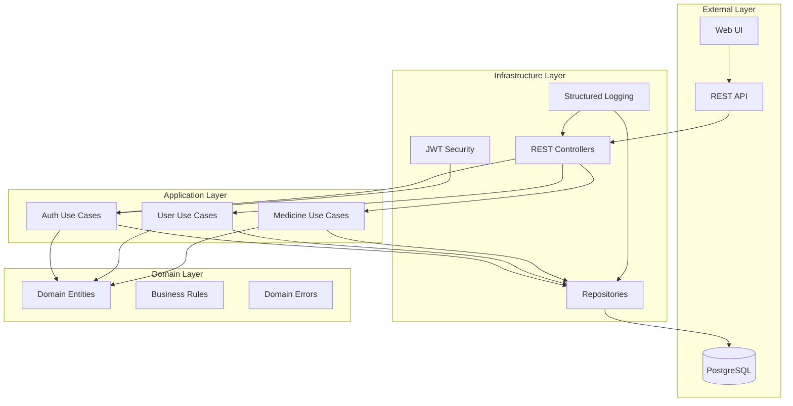
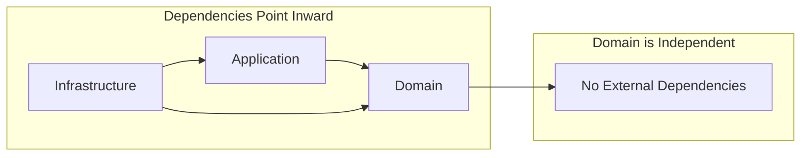
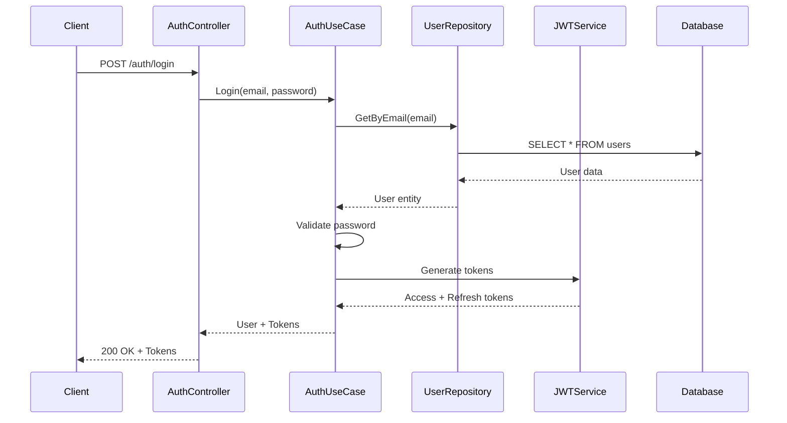
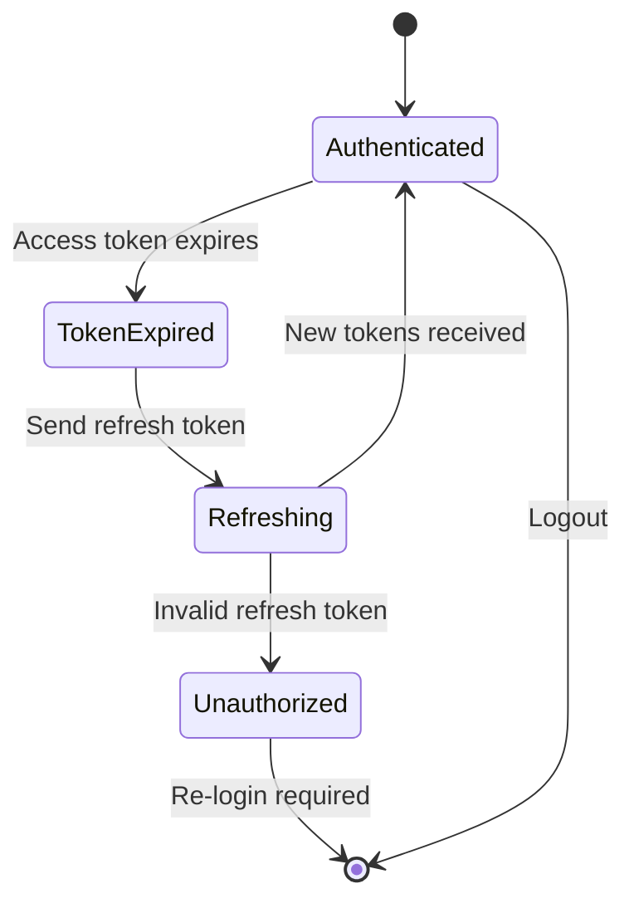
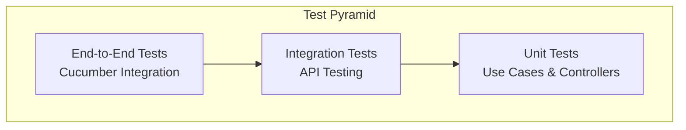

# Golang Microservices - Clean Architecture

[](https://github.com/gbrayhan/microservices-go/tree/master/.github/ISSUE_TEMPLATE)
[](https://github.com/gbrayhan/microservices-go/network/members)
[](https://github.com/gbrayhan/microservices-go/stargazers)
[](https://github.com/gbrayhan/microservices-go/tree/master/LICENSE)
[](https://www.codefactor.io/repository/github/gbrayhan/microservices-go/overview/main)
[](https://www.codacy.com/gh/gbrayhan/microservices-go/dashboard?utm_source=github.com&amp;utm_medium=referral&amp;utm_content=gbrayhan/microservices-go&amp;utm_campaign=Badge_Grade)

A production-ready microservices boilerplate built with Go, implementing Clean Architecture principles with comprehensive testing, security, and documentation.

## 🏗️ Architecture Overview

### Clean Architecture Layers



### Dependency Flow



## 🚀 Quick Start

### Prerequisites

- Go 1.24.2+
- Docker & Docker Compose
- PostgreSQL (via Docker)

### Installation

```bash
# Clone the repository
git clone https://github.com/gbrayhan/microservices-go
cd microservices-go

# Copy environment file
cp .env.example .env

# Start services
docker-compose up --build -d
```

### Verify Installation

```bash
# Check if services are running
docker-compose ps

# Test the API
curl http://localhost:8080/v1/health
```

## 📋 Features

### Core Features
- **Clean Architecture**: Fully implemented with dependency inversion
- **JWT Authentication**: Secure token-based authentication
- **Structured Logging**: Zap logger with correlation IDs
- **Comprehensive Testing**: Unit, integration, and acceptance tests
- **API Documentation**: Complete REST API documentation
- **Error Handling**: Centralized error management
- **Validation**: Request validation with custom rules
- **Search & Pagination**: Advanced search capabilities

### Technical Stack
- **Framework**: Gin-Gonic (HTTP router)
- **Database**: PostgreSQL with GORM
- **Authentication**: JWT with refresh tokens
- **Logging**: Zap structured logger
- **Testing**: Go testing + Cucumber integration tests
- **Documentation**: Comprehensive API documentation
- **Containerization**: Docker & Docker Compose
- **Code Quality**: golangci-lint, CodeFactor, Codacy

## 🔧 Development

### Project Structure

```
microservices-go/
├── src/
│   ├── domain/           # 🎯 Domain Layer (Entities & Business Rules)
│   ├── application/      # 📋 Application Layer (Use Cases)
│   └── infrastructure/   # 🔧 Infrastructure Layer
│       ├── di/           # Dependency Injection
│       ├── repository/   # Data Access Layer
│       ├── rest/         # HTTP Controllers
│       ├── security/     # JWT & Security
│       └── logger/       # Structured Logging
├── Test/
│   └── integration/      # Integration Tests
├── docs/                 # Documentation
└── docker-compose.yml    # Development Environment
```

### Available Commands

```bash
# Run the application
go run main.go

# Run tests
go test ./...

# Run tests with coverage
./coverage.sh

# Run integration tests
./Test/integration/run-integration-test.bash

# Lint code
golangci-lint run ./...

# Security scan
trivy fs .
```

## 🔐 Authentication Flow

### Login Sequence



### Token Refresh Flow



## 📊 API Endpoints

### Authentication
- `POST /v1/auth/login` - User login
- `POST /v1/auth/access-token` - Refresh access token

### Users
- `GET /v1/user` - Get all users
- `POST /v1/user` - Create user
- `GET /v1/user/:id` - Get user by ID
- `PUT /v1/user/:id` - Update user
- `DELETE /v1/user/:id` - Delete user
- `GET /v1/user/search` - Search users with pagination
- `GET /v1/user/search-property` - Search by specific property

### Medicines
- `GET /v1/medicine` - Get all medicines
- `POST /v1/medicine` - Create medicine
- `GET /v1/medicine/:id` - Get medicine by ID
- `PUT /v1/medicine/:id` - Update medicine
- `DELETE /v1/medicine/:id` - Delete medicine
- `GET /v1/medicine/search` - Search medicines with pagination
- `GET /v1/medicine/search-property` - Search by specific property

## 🧪 Testing Strategy

### Test Pyramid



### Test Coverage

```bash
# Run all tests with coverage
./coverage.sh

# Expected coverage: ≥ 80%
```

## 🔒 Security Features

- **JWT Authentication**: Access and refresh tokens
- **Password Hashing**: bcrypt with salt
- **CORS Configuration**: Cross-origin resource sharing
- **Input Validation**: Request sanitization
- **Error Handling**: No sensitive data exposure
- **Security Headers**: XSS protection, content security policy

## 📈 Monitoring & Observability

### Logging Structure

```json
{
  "level": "info",
  "timestamp": "2024-01-01T00:00:00Z",
  "message": "User login successful",
  "user_id": 123,
  "email": "user@example.com",
  "correlation_id": "req-123-456",
  "service": "auth-service"
}
```

### Health Checks

```bash
# Health endpoint
GET /v1/health

# Response
{
  "status": "healthy",
  "timestamp": "2024-01-01T00:00:00Z",
  "version": "1.0.0"
}
```

## 🚀 Deployment

### Docker Deployment

```bash
# Build production image
docker build -t microservices-go .

# Run with environment variables
docker run -p 8080:8080 \
  -e DB_HOST=postgres \
  -e DB_PORT=5432 \
  -e JWT_ACCESS_SECRET=your_secret \
  microservices-go
```

### Environment Variables

```bash
# Server Configuration
SERVER_PORT=8080
GO_ENV=production

# Database Configuration
DB_HOST=localhost
DB_PORT=5432
DB_USER=postgres
DB_PASSWORD=password
DB_NAME=microservices_go

# JWT Configuration
JWT_ACCESS_SECRET=your_access_secret
JWT_REFRESH_SECRET=your_refresh_secret
JWT_ACCESS_TIME_MINUTE=60
JWT_REFRESH_TIME_HOUR=24
```

## 📚 Documentation

- [Clean Architecture Guide](docs/README_CLEAN_ARCHITECTURE.md) - Detailed architecture documentation
- [API Search Endpoints](docs/SEARCH_ENDPOINTS.md) - Search and pagination features
- [Complete API Documentation](docs/API_DOCUMENTATION.md) - Full API reference

## 🤝 Contributing

1. Fork the repository
2. Create a feature branch (`git checkout -b feature/amazing-feature`)
3. Commit your changes (`git commit -m 'Add amazing feature'`)
4. Push to the branch (`git push origin feature/amazing-feature`)
5. Open a Pull Request

### Development Guidelines

- Follow Clean Architecture principles
- Write tests for new features
- Maintain ≥ 80% test coverage
- Use conventional commit messages
- Update documentation for API changes

## 📄 License

This project is licensed under the MIT License - see the [LICENSE](LICENSE) file for details.

## 🆘 Support

- **Issues**: [GitHub Issues](https://github.com/gbrayhan/microservices-go/issues)
- **Documentation**: [Wiki](https://github.com/gbrayhan/microservices-go/wiki)
- **Discussions**: [GitHub Discussions](https://github.com/gbrayhan/microservices-go/discussions)

## 🔄 Changelog

### v2.0.0 (Latest)
- ✅ Implemented Clean Architecture
- ✅ Added comprehensive search and pagination
- ✅ Enhanced error handling and logging
- ✅ Improved test coverage and quality
- ✅ Added integration tests with Cucumber
- ✅ Updated all documentation to English
- ✅ Added architecture diagrams and flow charts

### v1.0.0
- ✅ Initial microservices structure
- ✅ Basic CRUD operations
- ✅ JWT authentication
- ✅ PostgreSQL integration


