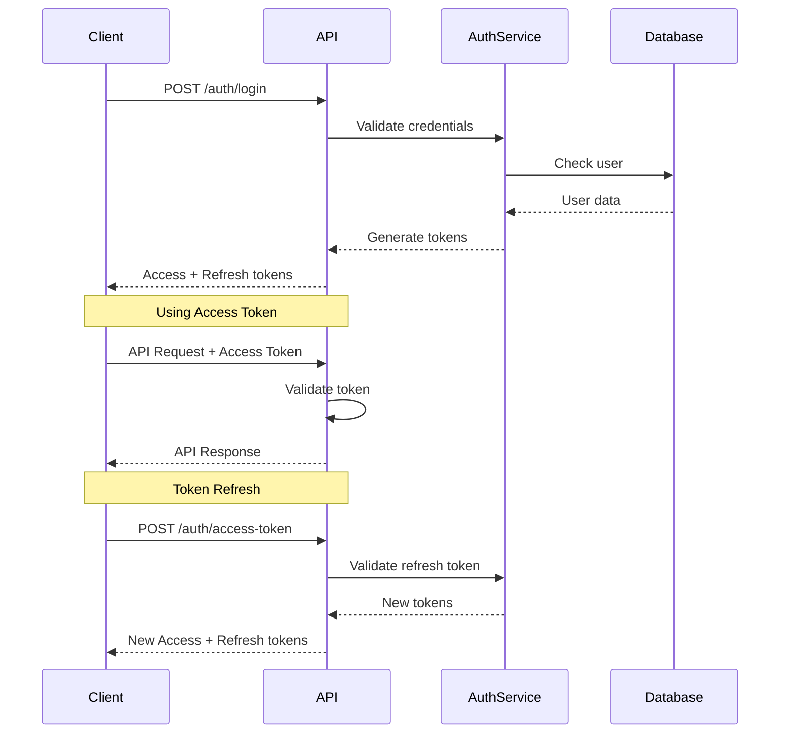
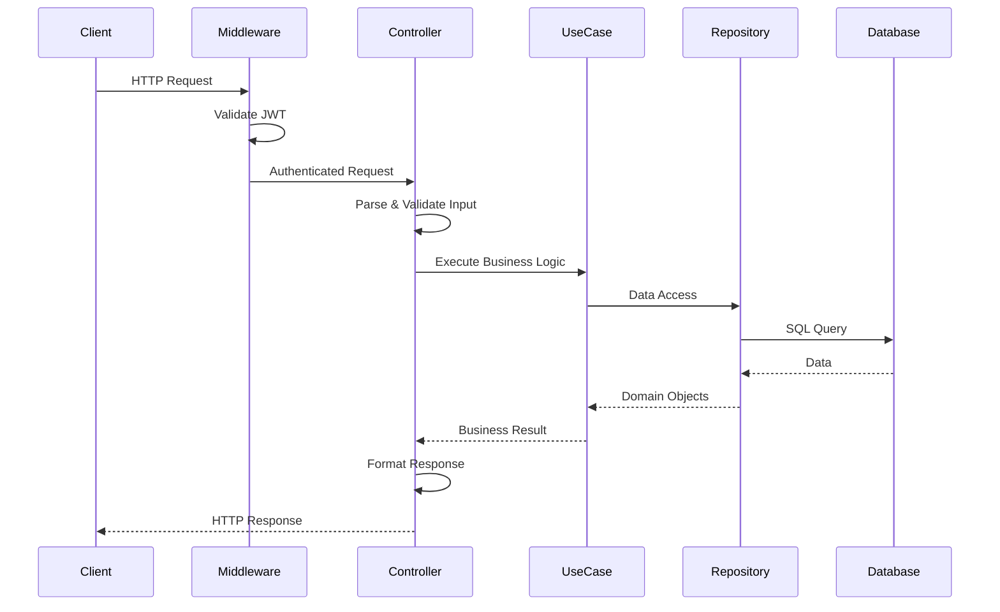
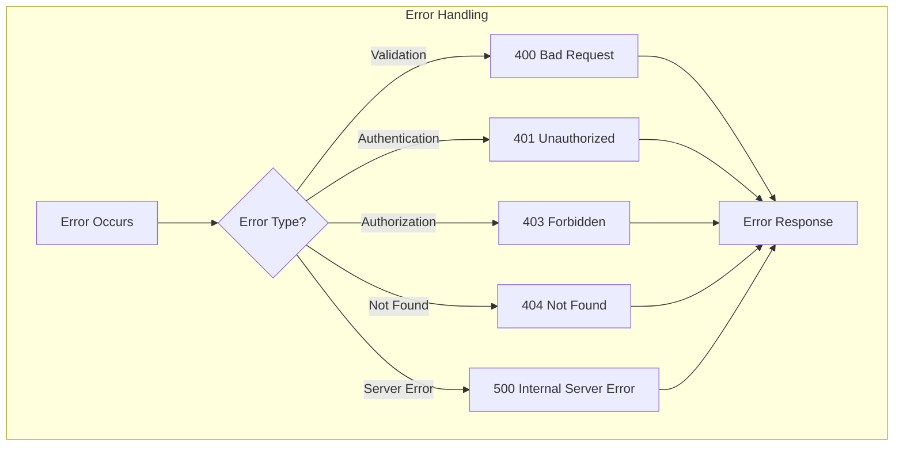

# API Documentation

## 🌐 API Overview

This document provides comprehensive documentation for the Microservices Go API, including all endpoints, request/response formats, authentication, and examples.

### Base URL
```
http://localhost:8080/v1
```

### API Version
- **Current Version**: v1
- **Status**: Production Ready
- **Last Updated**: 2024

## 🔐 Authentication

### JWT Authentication

All API endpoints (except authentication endpoints) require JWT authentication.

```http
Authorization: Bearer <access_token>
```

### Token Types

- **Access Token**: Short-lived (60 minutes), used for API requests
- **Refresh Token**: Long-lived (24 hours), used to obtain new access tokens

### Authentication Flow



## 📊 API Endpoints

### Authentication Endpoints

#### 1. User Login

**Endpoint:** `POST /auth/login`

**Description:** Authenticate user and receive access/refresh tokens

**Request Body:**
```json
{
  "email": "user@example.com",
  "password": "password123"
}
```

**Response:**
```json
{
  "data": {
    "userName": "john_doe",
    "email": "user@example.com",
    "firstName": "John",
    "lastName": "Doe",
    "status": true,
    "id": 1
  },
  "security": {
    "jwtAccessToken": "eyJhbGciOiJIUzI1NiIsInR5cCI6IkpXVCJ9...",
    "jwtRefreshToken": "eyJhbGciOiJIUzI1NiIsInR5cCI6IkpXVCJ9...",
    "expirationAccessDateTime": "2024-01-01T01:00:00Z",
    "expirationRefreshDateTime": "2024-01-02T00:00:00Z"
  }
}
```

**Status Codes:**
- `200 OK` - Login successful
- `400 Bad Request` - Invalid request data
- `401 Unauthorized` - Invalid credentials

#### 2. Refresh Access Token

**Endpoint:** `POST /auth/access-token`

**Description:** Get new access token using refresh token

**Request Body:**
```json
{
  "refreshToken": "eyJhbGciOiJIUzI1NiIsInR5cCI6IkpXVCJ9..."
}
```

**Response:** Same as login response with new tokens

**Status Codes:**
- `200 OK` - Token refresh successful
- `400 Bad Request` - Invalid request data
- `401 Unauthorized` - Invalid refresh token

### User Management Endpoints

#### 1. Get All Users

**Endpoint:** `GET /user`

**Description:** Retrieve all users with pagination

**Headers:**
```http
Authorization: Bearer <access_token>
```

**Response:**
```json
[
  {
    "id": 1,
    "userName": "john_doe",
    "email": "john@example.com",
    "firstName": "John",
    "lastName": "Doe",
    "status": true,
    "createdAt": "2024-01-01T00:00:00Z",
    "updatedAt": "2024-01-01T00:00:00Z"
  }
]
```

#### 2. Create User

**Endpoint:** `POST /user`

**Description:** Create a new user

**Request Body:**
```json
{
  "user": "new_user",
  "email": "newuser@example.com",
  "firstName": "New",
  "lastName": "User",
  "password": "password123",
  "role": "user"
}
```

**Response:**
```json
{
  "id": 2,
  "userName": "new_user",
  "email": "newuser@example.com",
  "firstName": "New",
  "lastName": "User",
  "status": true,
  "createdAt": "2024-01-01T00:00:00Z",
  "updatedAt": "2024-01-01T00:00:00Z"
}
```

#### 3. Get User by ID

**Endpoint:** `GET /user/{id}`

**Description:** Retrieve user by ID

**Path Parameters:**
- `id` (integer): User ID

**Response:** Same as user object in array

#### 4. Update User

**Endpoint:** `PUT /user/{id}`

**Description:** Update user information

**Path Parameters:**
- `id` (integer): User ID

**Request Body:** (Partial updates supported)
```json
{
  "firstName": "Updated",
  "lastName": "Name",
  "email": "updated@example.com"
}
```

**Response:** Updated user object

#### 5. Delete User

**Endpoint:** `DELETE /user/{id}`

**Description:** Delete user by ID

**Path Parameters:**
- `id` (integer): User ID

**Response:**
```json
{
  "message": "resource deleted successfully"
}
```

#### 6. Search Users (Paginated)

**Endpoint:** `GET /user/search`

**Description:** Advanced search with pagination and filtering

**Query Parameters:**
- `page` (optional): Page number (default: 1)
- `pageSize` (optional): Items per page (default: 10)
- `sortBy` (optional): Sort fields (multiple allowed)
- `sortDirection` (optional): asc/desc (default: asc)
- `email_like` (optional): Partial email search
- `firstName_like` (optional): Partial first name search
- `lastName_like` (optional): Partial last name search
- `status_match` (optional): Exact status match
- `createdAt_start` (optional): Start date (RFC3339)
- `createdAt_end` (optional): End date (RFC3339)

**Example Request:**
```
GET /user/search?page=1&pageSize=10&email_like=john&sortBy=createdAt&sortDirection=desc
```

**Response:**
```json
{
  "data": [
    {
      "id": 1,
      "userName": "john_doe",
      "email": "john@example.com",
      "firstName": "John",
      "lastName": "Doe",
      "status": true,
      "createdAt": "2024-01-01T00:00:00Z",
      "updatedAt": "2024-01-01T00:00:00Z"
    }
  ],
  "total": 1,
  "page": 1,
  "pageSize": 10,
  "totalPages": 1,
  "filters": {
    "likeFilters": {
      "email": ["john"]
    },
    "matches": {},
    "dateRanges": [],
    "sortBy": ["createdAt"],
    "sortDirection": "desc",
    "page": 1,
    "pageSize": 10
  }
}
```

#### 7. Search User Properties

**Endpoint:** `GET /user/search-property`

**Description:** Get unique values for a specific property

**Query Parameters:**
- `property` (required): Property name (userName, email, firstName, lastName, status)
- `searchText` (required): Search text

**Example Request:**
```
GET /user/search-property?property=email&searchText=john
```

**Response:**
```json
["john@example.com", "johnny@example.com"]
```

### Medicine Management Endpoints

#### 1. Get All Medicines

**Endpoint:** `GET /medicine`

**Description:** Retrieve all medicines

**Response:**
```json
[
  {
    "id": 1,
    "name": "Aspirin",
    "description": "Pain reliever",
    "eanCode": "1234567890123",
    "laboratory": "Bayer",
    "createdAt": "2024-01-01T00:00:00Z",
    "updatedAt": "2024-01-01T00:00:00Z"
  }
]
```

#### 2. Create Medicine

**Endpoint:** `POST /medicine`

**Description:** Create a new medicine

**Request Body:**
```json
{
  "name": "New Medicine",
  "description": "Medicine description",
  "laboratory": "Pharma Lab",
  "eanCode": "9876543210987"
}
```

**Response:** Created medicine object

#### 3. Get Medicine by ID

**Endpoint:** `GET /medicine/{id}`

**Description:** Retrieve medicine by ID

**Path Parameters:**
- `id` (integer): Medicine ID

#### 4. Update Medicine

**Endpoint:** `PUT /medicine/{id}`

**Description:** Update medicine information

**Path Parameters:**
- `id` (integer): Medicine ID

**Request Body:** (Partial updates supported)
```json
{
  "name": "Updated Medicine",
  "description": "Updated description"
}
```

#### 5. Delete Medicine

**Endpoint:** `DELETE /medicine/{id}`

**Description:** Delete medicine by ID

**Path Parameters:**
- `id` (integer): Medicine ID

**Response:**
```json
{
  "message": "resource deleted successfully"
}
```

#### 6. Search Medicines (Paginated)

**Endpoint:** `GET /medicine/search`

**Description:** Advanced search with pagination and filtering

**Query Parameters:**
- `page` (optional): Page number (default: 1)
- `pageSize` (optional): Items per page (default: 10)
- `sortBy` (optional): Sort fields (multiple allowed)
- `sortDirection` (optional): asc/desc (default: asc)
- `name_like` (optional): Partial name search
- `description_like` (optional): Partial description search
- `laboratory_match` (optional): Exact laboratory match
- `eanCode_like` (optional): Partial EAN code search
- `createdAt_start` (optional): Start date (RFC3339)
- `createdAt_end` (optional): End date (RFC3339)

**Example Request:**
```
GET /medicine/search?page=1&pageSize=10&name_like=aspirin&sortBy=name&sortDirection=asc
```

**Response:**
```json
{
  "data": [
    {
      "id": 1,
      "name": "Aspirin",
      "description": "Pain reliever",
      "eanCode": "1234567890123",
      "laboratory": "Bayer",
      "createdAt": "2024-01-01T00:00:00Z",
      "updatedAt": "2024-01-01T00:00:00Z"
    }
  ],
  "total": 1,
  "page": 1,
  "pageSize": 10,
  "totalPages": 1,
  "filters": {
    "likeFilters": {
      "name": ["aspirin"]
    },
    "matches": {},
    "dateRanges": [],
    "sortBy": ["name"],
    "sortDirection": "asc",
    "page": 1,
    "pageSize": 10
  }
}
```

#### 7. Search Medicine Properties

**Endpoint:** `GET /medicine/search-property`

**Description:** Get unique values for a specific property

**Query Parameters:**
- `property` (required): Property name (name, description, eanCode, laboratory)
- `searchText` (required): Search text

**Example Request:**
```
GET /medicine/search-property?property=name&searchText=asp
```

**Response:**
```json
["Aspirin", "Aspartame"]
```

## 🔄 Request/Response Flow

### Standard Request Flow



### Error Handling Flow



## 📊 Data Models

### User Model

```json
{
  "id": 1,
  "userName": "john_doe",
  "email": "john@example.com",
  "firstName": "John",
  "lastName": "Doe",
  "status": true,
  "createdAt": "2024-01-01T00:00:00Z",
  "updatedAt": "2024-01-01T00:00:00Z"
}
```

### Medicine Model

```json
{
  "id": 1,
  "name": "Aspirin",
  "description": "Pain reliever",
  "eanCode": "1234567890123",
  "laboratory": "Bayer",
  "createdAt": "2024-01-01T00:00:00Z",
  "updatedAt": "2024-01-01T00:00:00Z"
}
```

### Paginated Response Model

```json
{
  "data": [],
  "total": 100,
  "page": 1,
  "pageSize": 10,
  "totalPages": 10,
  "filters": {
    "likeFilters": {},
    "matches": {},
    "dateRanges": [],
    "sortBy": [],
    "sortDirection": "asc",
    "page": 1,
    "pageSize": 10
  }
}
```

## ⚠️ Error Responses

### Standard Error Format

```json
{
  "error": "Error message",
  "details": "Additional error details"
}
```

### Common Error Codes

| Status Code | Description | Example |
|-------------|-------------|---------|
| 400 | Bad Request | Invalid input data |
| 401 | Unauthorized | Missing or invalid token |
| 403 | Forbidden | Insufficient permissions |
| 404 | Not Found | Resource not found |
| 422 | Unprocessable Entity | Validation errors |
| 500 | Internal Server Error | Server error |

### Validation Error Example

```json
{
  "error": "Validation error",
  "details": "Field 'email' is required"
}
```

## 🚀 Usage Examples

### Complete Authentication Flow

```bash
# 1. Login
curl -X POST http://localhost:8080/v1/auth/login \
  -H "Content-Type: application/json" \
  -d '{
    "email": "user@example.com",
    "password": "password123"
  }'

# 2. Use access token for API requests
curl -X GET http://localhost:8080/v1/user \
  -H "Authorization: Bearer <access_token>"

# 3. Refresh token when access token expires
curl -X POST http://localhost:8080/v1/auth/access-token \
  -H "Content-Type: application/json" \
  -d '{
    "refreshToken": "<refresh_token>"
  }'
```

### Advanced Search Example

```bash
# Complex search with multiple filters
curl -X GET "http://localhost:8080/v1/medicine/search?\
page=1&\
pageSize=20&\
name_like=aspirin&\
laboratory_match=Bayer&\
laboratory_match=Pfizer&\
createdAt_start=2024-01-01T00:00:00Z&\
createdAt_end=2024-12-31T23:59:59Z&\
sortBy=name&\
sortBy=createdAt&\
sortDirection=desc" \
-H "Authorization: Bearer <access_token>"
```

### CRUD Operations Example

```bash
# Create user
curl -X POST http://localhost:8080/v1/user \
  -H "Authorization: Bearer <access_token>" \
  -H "Content-Type: application/json" \
  -d '{
    "user": "new_user",
    "email": "newuser@example.com",
    "firstName": "New",
    "lastName": "User",
    "password": "password123",
    "role": "user"
  }'

# Get user by ID
curl -X GET http://localhost:8080/v1/user/1 \
  -H "Authorization: Bearer <access_token>"

# Update user
curl -X PUT http://localhost:8080/v1/user/1 \
  -H "Authorization: Bearer <access_token>" \
  -H "Content-Type: application/json" \
  -d '{
    "firstName": "Updated",
    "lastName": "Name"
  }'

# Delete user
curl -X DELETE http://localhost:8080/v1/user/1 \
  -H "Authorization: Bearer <access_token>"
```

## 🔧 Development Tools

### Postman Collection

Import the Postman collection for testing:
```
https://www.postman.com/kts-mexico/workspace/boilerplategomicroservice
```

### API Testing

```bash
# Run integration tests
./Test/integration/run-integration-test.bash

# Run unit tests
go test ./...

# Run tests with coverage
./coverage.sh
```

## 📈 Performance Considerations

### Rate Limiting
- **Requests per minute**: 1000
- **Burst limit**: 100 requests

### Response Times
- **Simple queries**: < 50ms
- **Complex searches**: < 200ms
- **Bulk operations**: < 500ms

### Pagination Limits
- **Maximum page size**: 100 items
- **Default page size**: 10 items

## 🔒 Security Considerations

### Input Validation
- All inputs are validated and sanitized
- SQL injection protection
- XSS protection

### Authentication
- JWT tokens with short expiration
- Refresh token rotation
- Secure password hashing

### Authorization
- Role-based access control
- Resource-level permissions
- Audit logging

## 🔄 API Versioning

### Version Strategy
- **URL Versioning**: `/v1/`, `/v2/`
- **Backward Compatibility**: Maintained for 1 year
- **Deprecation Notice**: 6 months advance notice

### Migration Guide
When upgrading between versions, refer to the migration guide in the release notes.

## 📞 Support

### Getting Help
- **Documentation**: This document and API reference
- **Issues**: GitHub Issues
- **Discussions**: GitHub Discussions
- **Email**: support@example.com

### Contributing
See [CONTRIBUTING.md](../CONTRIBUTING.md) for development guidelines.

---

**Last Updated**: 2024  
**API Version**: v1  
**Status**: Production Ready 