# Clean Architecture Implementation Guide

## 🏗️ Clean Architecture Overview

This project implements **Clean Architecture** principles following Robert C. Martin's guidelines, ensuring **100% testability** and **framework independence**.

## 📁 Layer Structure

```
src/
├── domain/           # 🎯 Domain Layer (Entities and Business Rules)
├── application/      # 📋 Application Layer (Use Cases)
├── infrastructure/   # 🔧 Infrastructure Layer (Implementations)
│   ├── di/           # 🎯 Dependency Container
│   ├── repository/   # 💾 Repositories
│   ├── rest/         # 🌐 REST Controllers
│   ├── security/     # 🔐 Security Services
│   └── logger/       # 📝 Structured Logging
```

## 🔄 Architecture Principles

### 1. **Dependency Inversion Principle (DIP)**
- Dependencies point inward (towards the domain)
- External layers depend on internal layers through interfaces

### 2. **Single Responsibility Principle (SRP)**
- Each class has a single responsibility
- Clear separation between business logic and technical details

### 3. **Open/Closed Principle (OCP)**
- Open for extension, closed for modification
- New features are added without modifying existing code

### 4. **Interface Segregation Principle (ISP)**
- Small and specific interfaces
- Clients don't depend on methods they don't use

## 🎯 Detailed Architecture Diagrams

### Clean Architecture Layers


### Dependency Flow


### Use Case Flow


## 🎯 Implemented Improvements

### 1. **Dependency Container (DI Container)**

```go
// src/infrastructure/di/ApplicationContext.go
type ApplicationContext struct {
    DB                 *gorm.DB
    AuthController     authController.IAuthController
    UserController     userController.IUserController
    MedicineController medicineController.IMedicineController
    JWTService         security.IJWTService
    UserRepository     user.UserRepositoryInterface
    MedicineRepository medicine.MedicineRepositoryInterface
    AuthUseCase        authUseCase.IAuthUseCase
    UserUseCase        userUseCase.IUserUseCase
    MedicineUseCase    medicineUseCase.IMedicineUseCase
}
```

**Benefits:**
- ✅ Centralized dependency injection
- ✅ Easy testing with mocks
- ✅ Component decoupling
- ✅ Single configuration for the entire application

### 2. **Well-Defined Interfaces**

```go
// JWT Service Interface
type IJWTService interface {
    GenerateJWTToken(userID int, tokenType string) (*AppToken, error)
    GetClaimsAndVerifyToken(tokenString string, tokenType string) (jwt.MapClaims, error)
}

// User Repository Interface
type IUserRepository interface {
    GetAll() (*[]domainUser.User, error)
    Create(user *domainUser.User) (*domainUser.User, error)
    GetByID(id int) (*domainUser.User, error)
    Update(id int, user *domainUser.User) (*domainUser.User, error)
    Delete(id int) error
    GetByEmail(email string) (*domainUser.User, error)
    SearchPaginated(filters domain.SearchFilters) (*domain.PaginatedResult, error)
    SearchByProperty(property, searchText string) (*[]string, error)
}
```

### 3. **Refactored Use Cases**

```go
// src/application/usecases/auth/auth.go
type AuthUseCase struct {
    userRepository userDomain.IUserService
    jwtService     security.IJWTService
    logger         *logger.Logger
}

func NewAuthUseCase(userRepository userDomain.IUserService, jwtService security.IJWTService, logger *logger.Logger) IAuthUseCase {
    return &AuthUseCase{
        userRepository: userRepository,
        jwtService:     jwtService,
        logger:         logger,
    }
}
```

## 🔐 Authentication State Machine

### User Authentication States


### JWT Token Lifecycle


## 🧪 Testing Architecture

### Test Pyramid Implementation

```mermaid
graph TB
    subgraph "Test Pyramid"
        E2E[End-to-End Tests<br/>Cucumber Integration<br/>5% of tests]
        Integration[Integration Tests<br/>API Testing<br/>15% of tests]
        Unit[Unit Tests<br/>Use Cases & Controllers<br/>80% of tests]
    end
    
    E2E --> Integration
    Integration --> Unit
    
    subgraph "Test Coverage"
        Coverage[≥ 80% Coverage]
        Quality[Code Quality Gates]
        Security[Security Scans]
    end
```



### Unit Testing with Mocks

```go
// src/application/usecases/auth/auth_test.go
type mockJWTService struct {
    generateTokenFn func(int, string) (*security.AppToken, error)
    verifyTokenFn   func(string, string) (jwt.MapClaims, error)
}

func (m *mockJWTService) GenerateJWTToken(userID int, tokenType string) (*security.AppToken, error) {
    return m.generateTokenFn(userID, tokenType)
}

func TestAuthUseCase_Login_Success(t *testing.T) {
    // Arrange
    mockUserRepo := &mockUserRepository{
        getByEmailFn: func(email string) (*userDomain.User, error) {
            return &userDomain.User{
                ID:       1,
                Email:    "test@example.com",
                Password: "$2a$10$hashedpassword",
            }, nil
        },
    }
    
    mockJWTService := &mockJWTService{
        generateTokenFn: func(userID int, tokenType string) (*security.AppToken, error) {
            return &security.AppToken{
                AccessToken:  "access_token",
                RefreshToken: "refresh_token",
            }, nil
        },
    }
    
    useCase := NewAuthUseCase(mockUserRepo, mockJWTService, logger)
    
    // Act
    user, tokens, err := useCase.Login("test@example.com", "password")
    
    // Assert
    assert.NoError(t, err)
    assert.NotNil(t, user)
    assert.NotNil(t, tokens)
}
```

## 🔄 Data Flow Diagrams

### User Creation Flow


### Search and Pagination Flow


## 🎯 Error Handling Architecture

### Error Flow


### Error Types

```go
type ErrorType string

const (
    NotFound              ErrorType = "NotFound"
    ValidationError       ErrorType = "ValidationError"
    ResourceAlreadyExists ErrorType = "ResourceAlreadyExists"
    RepositoryError       ErrorType = "RepositoryError"
    NotAuthenticated      ErrorType = "NotAuthenticated"
    NotAuthorized         ErrorType = "NotAuthorized"
    TokenGeneratorError   ErrorType = "TokenGeneratorError"
    UnknownError          ErrorType = "UnknownError"
)
```

## 🚀 Performance Considerations

### Caching Strategy


### Database Optimization

- **Indexing**: Proper indexes on frequently queried fields
- **Connection Pooling**: Efficient database connection management
- **Query Optimization**: Optimized SQL queries with proper joins
- **Pagination**: Efficient pagination with cursor-based approach

## 🔒 Security Architecture

### Security Layers


## 📊 Monitoring and Observability

### Logging Architecture


### Metrics Collection

- **Request/Response Metrics**: Response times, status codes
- **Business Metrics**: User registrations, authentication attempts
- **System Metrics**: CPU, memory, database connections
- **Error Metrics**: Error rates, error types

## 🎯 Best Practices Implemented

### 1. **Dependency Injection**
- All dependencies are injected through interfaces
- Easy to mock for testing
- Loose coupling between components

### 2. **Error Handling**
- Centralized error handling
- Consistent error responses
- Proper HTTP status codes

### 3. **Logging**
- Structured logging with correlation IDs
- Different log levels for different environments
- Sensitive data filtering

### 4. **Validation**
- Input validation at multiple layers
- Business rule validation in use cases
- Database constraint validation

### 5. **Testing**
- Unit tests for all business logic
- Integration tests for API endpoints
- Mock-based testing for external dependencies

## 🔧 Development Workflow

### Code Quality Gates


### Development Commands

```bash
# Run all tests with coverage
./coverage.sh

# Run specific test suites
go test ./src/application/usecases/...
go test ./src/infrastructure/rest/controllers/...

# Code quality checks
golangci-lint run ./...
go vet ./...

# Security scanning
trivy fs .
gosec ./...
```

## 📈 Quality Metrics

### Test Coverage
- **Target:** ≥ 80%
- **Current:** Calculated automatically with `./coverage.sh`
- **Coverage Areas:** Use cases, controllers, repositories, security

### Code Quality
- **Linting:** golangci-lint with strict rules
- **Code Analysis:** CodeFactor and Codacy integration
- **Security:** Trivy vulnerability scanning

### Performance Metrics
- **Response Time:** < 200ms for most endpoints
- **Throughput:** 1000+ requests per second
- **Memory Usage:** < 100MB for typical usage

## 🎯 Future Enhancements

### Planned Improvements
1. **Event Sourcing**: Implement event-driven architecture
2. **CQRS**: Separate read and write models
3. **Microservices**: Split into domain-specific services
4. **API Gateway**: Centralized API management
5. **Service Mesh**: Inter-service communication
6. **Distributed Tracing**: End-to-end request tracking

### Scalability Considerations
- **Horizontal Scaling**: Stateless application design
- **Database Sharding**: Partition data by domain
- **Caching Strategy**: Redis for session and data caching
- **Load Balancing**: Multiple application instances
- **Auto-scaling**: Kubernetes-based deployment

This Clean Architecture implementation provides a solid foundation for building scalable, maintainable, and testable microservices applications. 