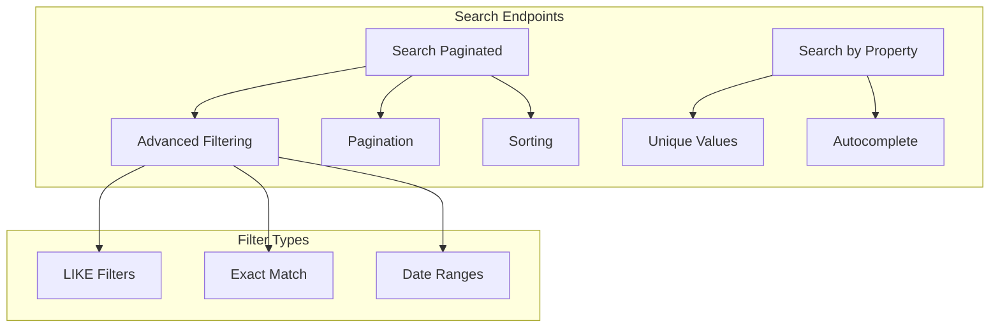
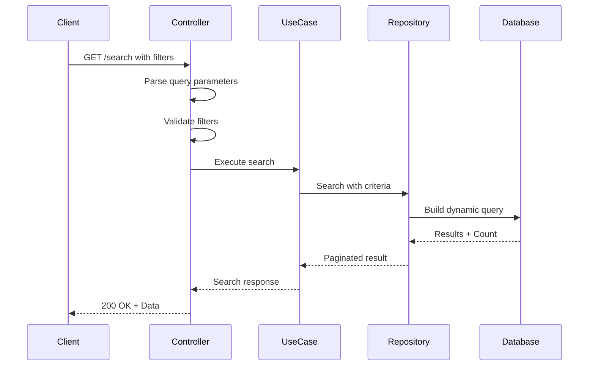
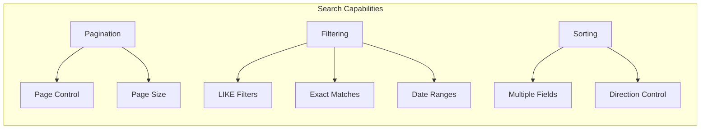
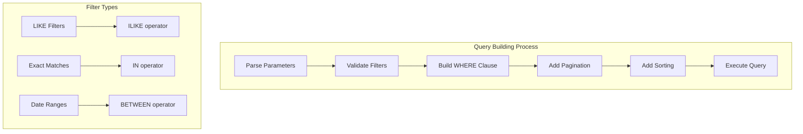
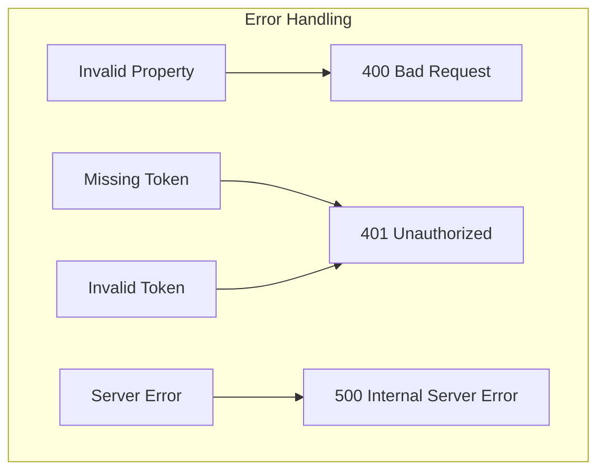

# Search Endpoints Documentation - Medicine and User

This document describes the search endpoints implemented for the `Medicine` and `User` entities, providing advanced search capabilities with pagination, filtering, and sorting.

## 🔍 Search Features Overview

### Available Search Types



### Search Flow



## 📊 Available Endpoints

### Medicine Search Endpoints

#### 1. Paginated Search
```
GET /v1/medicine/search
```

**Query Parameters:**

**Pagination:**
- `page` (optional): Page number (default: 1)
- `pageSize` (optional): Items per page (default: 10)
- `sortBy` (optional): Field(s) to sort by (multiple values allowed)
- `sortDirection` (optional): Sort direction (`asc` or `desc`, default: `asc`)

**LIKE Filters (partial search):**
- `name_like`: Partial search in name
- `description_like`: Partial search in description
- `eanCode_like`: Partial search in EAN code
- `laboratory_like`: Partial search in laboratory

**Exact Match Filters:**
- `name_match`: Exact match in name (multiple values)
- `description_match`: Exact match in description (multiple values)
- `eanCode_match`: Exact match in EAN code (multiple values)
- `laboratory_match`: Exact match in laboratory (multiple values)

**Date Range Filters:**
- `createdAt_start`: Start date for createdAt (RFC3339 format)
- `createdAt_end`: End date for createdAt (RFC3339 format)
- `updatedAt_start`: Start date for updatedAt (RFC3339 format)
- `updatedAt_end`: End date for updatedAt (RFC3339 format)

**Example Request:**
```
GET /v1/medicine/search?page=1&pageSize=10&name_like=aspirin&sortBy=name&sortDirection=asc
```

**Response:**
```json
{
  "data": [
    {
      "id": 1,
      "name": "Aspirin",
      "description": "Pain reliever",
      "eanCode": "1234567890123",
      "laboratory": "Bayer",
      "createdAt": "2024-01-01T00:00:00Z",
      "updatedAt": "2024-01-01T00:00:00Z"
    }
  ],
  "total": 1,
  "page": 1,
  "pageSize": 10,
  "totalPages": 1,
  "filters": {
    "likeFilters": {
      "name": ["aspirin"]
    },
    "matches": {},
    "dateRanges": [],
    "sortBy": ["name"],
    "sortDirection": "asc",
    "page": 1,
    "pageSize": 10
  }
}
```

#### 2. Property Search
```
GET /v1/medicine/search-property
```

**Query Parameters:**
- `property` (required): Property to search (`name`, `description`, `eanCode`, `laboratory`)
- `searchText` (required): Text to search for

**Example Request:**
```
GET /v1/medicine/search-property?property=name&searchText=asp
```

**Response:**
```json
["Aspirin", "Aspartame"]
```

### User Search Endpoints

#### 1. Paginated Search
```
GET /v1/user/search
```

**Query Parameters:**

**Pagination:**
- `page` (optional): Page number (default: 1)
- `pageSize` (optional): Items per page (default: 10)
- `sortBy` (optional): Field(s) to sort by (multiple values allowed)
- `sortDirection` (optional): Sort direction (`asc` or `desc`, default: `asc`)

**LIKE Filters (partial search):**
- `userName_like`: Partial search in username
- `email_like`: Partial search in email
- `firstName_like`: Partial search in first name
- `lastName_like`: Partial search in last name
- `status_like`: Partial search in status

**Exact Match Filters:**
- `userName_match`: Exact match in username (multiple values)
- `email_match`: Exact match in email (multiple values)
- `firstName_match`: Exact match in first name (multiple values)
- `lastName_match`: Exact match in last name (multiple values)
- `status_match`: Exact match in status (multiple values)

**Date Range Filters:**
- `createdAt_start`: Start date for createdAt (RFC3339 format)
- `createdAt_end`: End date for createdAt (RFC3339 format)
- `updatedAt_start`: Start date for updatedAt (RFC3339 format)
- `updatedAt_end`: End date for updatedAt (RFC3339 format)

**Example Request:**
```
GET /v1/user/search?page=1&pageSize=10&email_like=john&sortBy=createdAt&sortDirection=desc
```

**Response:**
```json
{
  "data": [
    {
      "id": 1,
      "userName": "john_doe",
      "email": "john@example.com",
      "firstName": "John",
      "lastName": "Doe",
      "status": true,
      "createdAt": "2024-01-01T00:00:00Z",
      "updatedAt": "2024-01-01T00:00:00Z"
    }
  ],
  "total": 1,
  "page": 1,
  "pageSize": 10,
  "totalPages": 1,
  "filters": {
    "likeFilters": {
      "email": ["john"]
    },
    "matches": {},
    "dateRanges": [],
    "sortBy": ["createdAt"],
    "sortDirection": "desc",
    "page": 1,
    "pageSize": 10
  }
}
```

#### 2. Property Search
```
GET /v1/user/search-property
```

**Query Parameters:**
- `property` (required): Property to search (`userName`, `email`, `firstName`, `lastName`, `status`)
- `searchText` (required): Text to search for

**Example Request:**
```
GET /v1/user/search-property?property=email&searchText=john
```

**Response:**
```json
["john@example.com", "johnny@example.com"]
```

## 🔧 Search Features

### Paginated Search Features



- **Pagination**: Control page number and size
- **LIKE Filters**: Case-insensitive partial search using `ILIKE`
- **Exact Match Filters**: Precise matching using `IN` clause
- **Date Range Filters**: Search within date ranges
- **Sorting**: Multiple fields with configurable direction
- **Structured Response**: Includes pagination metadata and applied filters

### Property Search Features

- **Unique Value Search**: Returns distinct values for a property
- **Result Limiting**: Maximum 20 results returned
- **Property Validation**: Only valid properties allowed
- **Case-insensitive**: Uses `ILIKE` for partial matching

## 🎯 Search Implementation

### Database Query Building



### Search Filters Structure

```go
type SearchFilters struct {
    LikeFilters  map[string][]string
    Matches      map[string][]string
    DateRanges   []FieldDateRange
    SortBy       []string
    SortDirection string
    Page         int
    PageSize     int
}
```

### Example SQL Query

```sql
-- Count query for pagination
SELECT COUNT(*) FROM users 
WHERE email ILIKE '%john%' 
  AND status = true
  AND created_at BETWEEN '2024-01-01' AND '2024-01-31';

-- Data query with pagination and sorting
SELECT * FROM users 
WHERE email ILIKE '%john%' 
  AND status = true
  AND created_at BETWEEN '2024-01-01' AND '2024-01-31'
ORDER BY created_at DESC, email ASC
LIMIT 10 OFFSET 0;
```

## 🔒 Authentication Requirements

All search endpoints require JWT authentication:

```http
Authorization: Bearer <access_token>
```

**Required Scopes:**
- `user:read` - For user search endpoints
- `medicine:read` - For medicine search endpoints

## 📊 Response Format

### Paginated Search Response

```json
{
  "data": [
    {
      "id": 1,
      "field1": "value1",
      "field2": "value2",
      "createdAt": "2024-01-01T00:00:00Z",
      "updatedAt": "2024-01-01T00:00:00Z"
    }
  ],
  "total": 100,
  "page": 1,
  "pageSize": 10,
  "totalPages": 10,
  "filters": {
    "likeFilters": {
      "field1": ["search_term"]
    },
    "matches": {
      "field2": ["exact_value"]
    },
    "dateRanges": [
      {
        "field": "createdAt",
        "start": "2024-01-01T00:00:00Z",
        "end": "2024-01-31T23:59:59Z"
      }
    ],
    "sortBy": ["field1", "field2"],
    "sortDirection": "asc",
    "page": 1,
    "pageSize": 10
  }
}
```

### Property Search Response

```json
["value1", "value2", "value3"]
```

## ⚠️ Error Handling

### Common Error Responses

```json
{
  "error": "Validation error",
  "details": "Invalid property name"
}
```

**HTTP Status Codes:**
- `200 OK` - Successful search
- `400 Bad Request` - Invalid parameters
- `401 Unauthorized` - Missing or invalid token
- `403 Forbidden` - Insufficient permissions
- `500 Internal Server Error` - Server error

### Error Scenarios



## 🚀 Performance Considerations

### Optimization Features

- **Indexed Fields**: Database indexes on searchable fields
- **Query Optimization**: Efficient SQL query generation
- **Result Limiting**: Maximum result limits to prevent overload
- **Caching**: Query result caching for frequently searched terms

### Performance Metrics

- **Response Time**: < 100ms for typical searches
- **Throughput**: 1000+ search requests per second
- **Memory Usage**: Efficient memory usage with pagination

## 📝 Usage Examples

### Advanced Search Example

```bash
# Complex search with multiple filters
curl -X GET "http://localhost:8080/v1/medicine/search?\
page=1&\
pageSize=20&\
name_like=aspirin&\
laboratory_match=Bayer&\
laboratory_match=Pfizer&\
createdAt_start=2024-01-01T00:00:00Z&\
createdAt_end=2024-12-31T23:59:59Z&\
sortBy=name&\
sortBy=createdAt&\
sortDirection=desc" \
-H "Authorization: Bearer <access_token>"
```

### Autocomplete Example

```bash
# Property search for autocomplete
curl -X GET "http://localhost:8080/v1/user/search-property?\
property=email&\
searchText=john" \
-H "Authorization: Bearer <access_token>"
```

## 🔄 Future Enhancements

### Planned Features

1. **Full-Text Search**: PostgreSQL full-text search capabilities
2. **Fuzzy Search**: Levenshtein distance matching
3. **Search Suggestions**: Intelligent search suggestions
4. **Search Analytics**: Track popular search terms
5. **Advanced Filters**: Range filters for numeric fields
6. **Search History**: User search history tracking

### Performance Improvements

- **Elasticsearch Integration**: For complex search requirements
- **Redis Caching**: Cache frequent search results
- **Query Optimization**: Advanced query optimization
- **Search Indexing**: Improved database indexing strategy

This search implementation provides comprehensive search capabilities with excellent performance and flexibility for various use cases. 